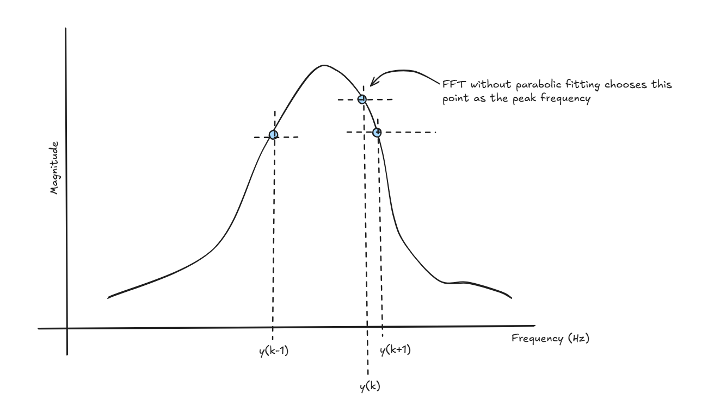

## How to use the repository

1. Access file `main.ipynb` to check how the PSD output signal is processed to find various parameters like damping constant and natural frequency of the excited cantilever.

2. Access file `best-fit-fft.ipynb` to check how the PSD signal is processed using FFT but peak frequency is determined by parabolic fitting of the three points near the peak.

3. `Waveforms` folder contains all datasets recorded uring the experiment using Picoscope 2000 series.
